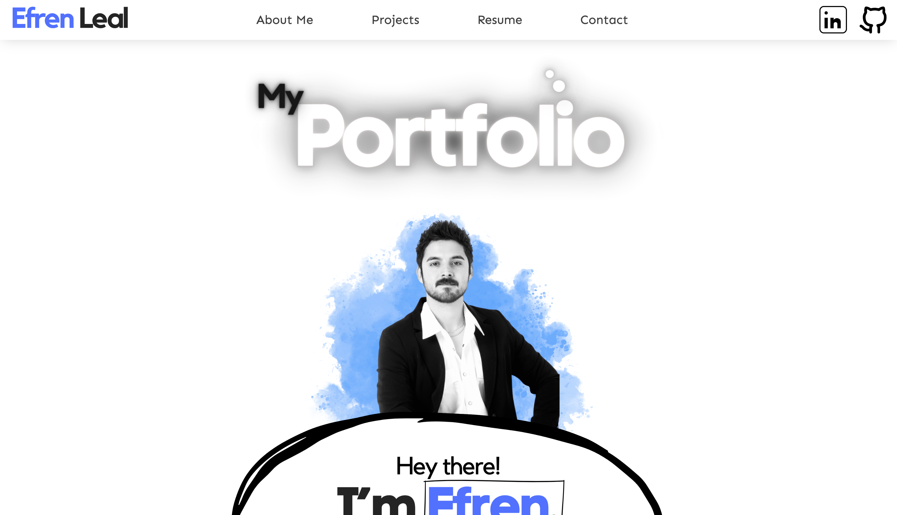

# Efren's Portfolio

  ## Description 
  As a web developer, we want to be able to showcase not only our work but our destinct personality or style, so having a personal portoflio does exactly that.

  ## Table of Contents
  * [Description](#description)
  * [Built with](#built-with)
  * [Installation Instructions](#installation-instructions)
  * [Deployment](#deployment)
  * [Questions](#questions)

  ## Built with

  * React
  * Vite
  * HTML
  * CSS
  * Java Script

  ## Installation Instructions
  1. Clone repository and open in VS Code.
  4. Install required npm packages by running <mark style="background-color:grey"> npm install  </mark> in terminal.
  7. Start application by running <mark style="background-color:grey"> npm start  </mark> .
  7. Open your browser and navigate to http://localhost:3000 

  ## Deployment
This application was deployed using Netflify. Visit deployed app here: 

## Screenshot

  ## Questions
 [Email me](mailto:efrenleal19@gmail.com)

 [GitHub Projects](https://www.github.com/Efren96)